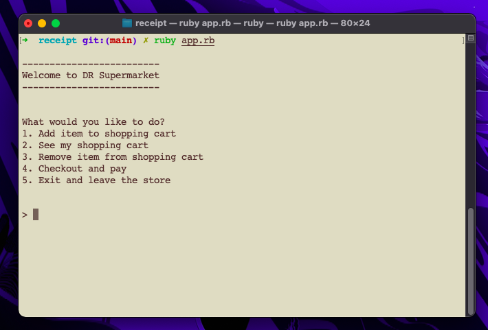
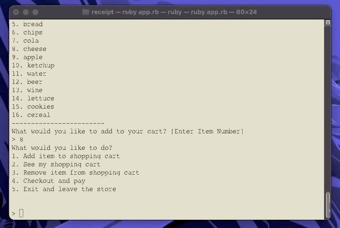
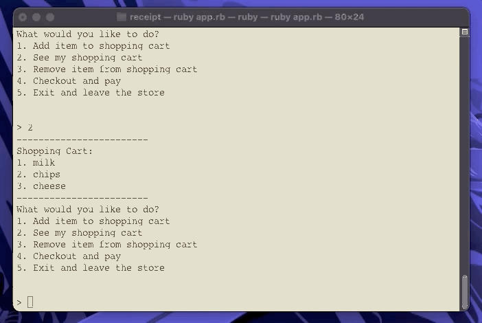
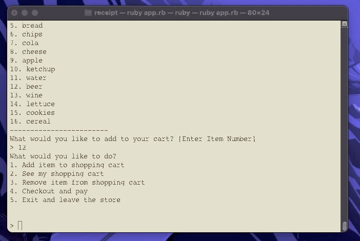

# DR Supermarket

DR Supermarket is a small simulation of a supermarket on the command line.

#### User Options

- The user has the options of what they want to do

#### Adding Items

- The user can choose from items in stock and add them to their cart

#### Viewing the Cart

- The user can view their cart

#### Remove items

- The user can remove any items they don't want anymore

#### Checkout

- I have added some more items...

- Once all is finished. The user can checkout.

- The final summary is listed with the item id, description and price

- At the bottom the total summary is displayed

This program was created with Ruby and followed Model View Controller Software Design Pattern.
